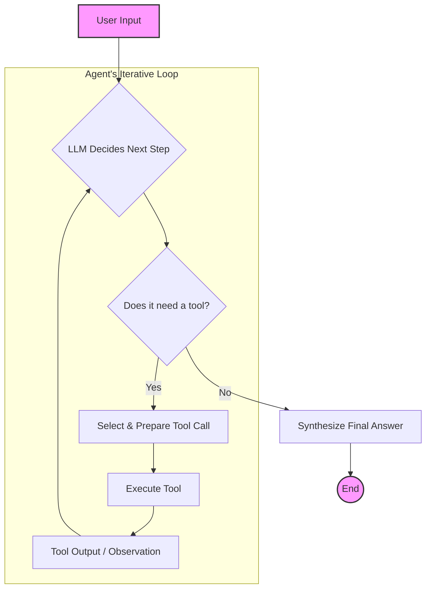

# nomoLLM-agent

# workflow
- User Input to LLM: The process begins with the user providing a request. This is fed into the LLM.
- LLM Decides Next Step: The LLM analyzes the user's query and the conversation history to determine the next action. It assesses whether it has enough information to answer directly or if it needs to use a tool.
- The "Tool or Not" Decision:
  - If a tool is needed (Yes): The LLM selects the appropriate tool and formulates the necessary input for it (e.g., a search query or API call).
  - If no tool is needed (No): The LLM has sufficient information to formulate a final response.
- Tool Execution and Observation: The chosen tool is executed, and the output (e.g., search results or data from an API) is returned to the agent. This output is a new "observation" for the LLM.
- Return to the LLM: This observation is then fed back into the LLM. This is a crucial part of the iterative process.
- The Loop Continues: The LLM now re-evaluates the situation with the new information. It might decide to use another tool, use the same tool with different parameters, or determine that it now has enough information to answer the user's original query. This loop of deciding, acting, and observing continues until the agent is ready to provide a final answer.
- Synthesize Final Answer: Once the LLM determines no more tools are needed, it synthesizes all the gathered information and its own knowledge to generate a comprehensive final answer for the user.